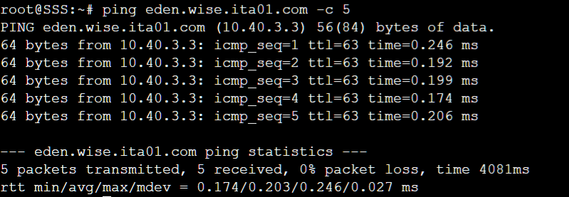

# soal-shift-jarkom-2-ITA01-2022

Repository Laporan Resmi Praktikum Jaringan Komputer Modul 2 Kelompok ITA01 Tahun 2022.

1. Damarhafni Rahmannabel Nadim P (5027201026)
2. Salman Al Farisi Sudirlan (5027201056)
3. I Putu Windy Arya Sagita (5027201071)

# Daftar Isi

* [Daftar Isi](https://github.com/windyarya/Jarkom-Modul-2-ITA01-2022#daftar-isi)
* [Soal 1](https://github.com/windyarya/Jarkom-Modul-2-ITA01-2022/#soal-1)
* [Soal 2](https://github.com/windyarya/Jarkom-Modul-2-ITA01-2022/#soal-2)
* [Soal 3](https://github.com/windyarya/Jarkom-Modul-2-ITA01-2022/soal-3)
* [Soal 4](https://github.com/windyarya/Jarkom-Modul-2-ITA01-2022/#soal-4)
* [Soal 5](https://github.com/windyarya/Jarkom-Modul-2-ITA01-2022/#soal-5)
* [Soal 6](https://github.com/windyarya/Jarkom-Modul-2-ITA01-2022/#soal-6)
* [Soal 7](https://github.com/windyarya/Jarkom-Modul-2-ITA01-2022/#soal-7)
* [Soal 8](https://github.com/windyarya/Jarkom-Modul-2-ITA01-2022/#soal-8)
* [Soal 9](https://github.com/windyarya/Jarkom-Modul-2-ITA01-2022/#soal-9)
* [Soal 10](https://github.com/windyarya/Jarkom-Modul-2-ITA01-2022/#soal-10)
* [Soal 11](https://github.com/windyarya/Jarkom-Modul-2-ITA01-2022/#soal-11)
* [Soal 12](https://github.com/windyarya/Jarkom-Modul-2-ITA01-2022/#soal-12)
* [Soal 13](https://github.com/windyarya/Jarkom-Modul-2-ITA01-2022/#soal-13)
* [Soal 14](https://github.com/windyarya/Jarkom-Modul-2-ITA01-2022/#soal-14)
* [Soal 15](https://github.com/windyarya/Jarkom-Modul-2-ITA01-2022/#soal-15)
* [Soal 16](https://github.com/windyarya/Jarkom-Modul-2-ITA01-2022/#soal-16)
* [Soal 17](https://github.com/windyarya/Jarkom-Modul-2-ITA01-2022/#soal-17)

# Soal 1
WISE akan dijadikan sebagai DNS Master, Berlint akan dijadikan DNS Slave, dan Eden akan digunakan sebagai Web Server. Terdapat 2 Client yaitu SSS, dan Garden. Semua node terhubung pada router Ostania, sehingga dapat mengakses internet.

## Analisa Soal
Pada soal ini kita akan melakukan setting/konfigurasi IP Address pada setiap node agar nantinya setiap node dapat mengakses jaringan internet.

## Pengerjaan Soal
### Topologi
Berikut adalah topologi jaringan untuk soal shift 2 yang kami buat:
<br>

### Konfigurasi IP Address
Berikut adalah konfigurasi IP untuk setiap node yang ada pada topologi kami.
#### Ostania
```
auto eth0
iface eth0 inet dhcp

auto eth1
iface eth1 inet static
        address 10.40.1.1
        netmask 255.255.255.0

auto eth2
iface eth2 inet static
       address 10.40.2.1
       netmask 255.255.255.0

auto eth3
iface eth3 inet static
       address 10.40.3.1
       netmask 255.255.255.0
```
#### WISE
```
auto eth0
iface eth0 inet static
       address 10.40.2.2
       netmask 255.255.255.0
       gateway 10.40.2.1
```
#### SSS
```
auto eth0
iface eth0 inet static
       address 10.40.1.2
       netmask 255.255.255.0
       gateway 10.40.1.1
```
#### Garden
```
auto eth0
iface eth0 inet static
       address 10.40.1.3
       netmask 255.255.255.0
       gateway 10.40.1.1
```
#### Berlint
```
auto eth0
iface eth0 inet static
       address 10.40.3.2
       netmask 255.255.255.0
       gateway 10.40.3.1
```
#### Eden
```
auto eth0
iface eth0 inet static
       address 10.40.3.3
       netmask 255.255.255.0
       gateway 10.40.3.1
```
Selain mengatur konfigurasi IP pada setiap node, kami juga menambahkan command iptables pada node Ostania
```
iptables -t nat -A POSTROUTING -o eth0 -j MASQUERADE -s 10.40.0.0/16
```
Kemudian, pada setiap node selain Ostania, kami perlu menambahkan command berikut.
```
echo "nameserver 192.168.122.1" > /etc/resolv.conf
```

## Kendala
Tidak ada

## Dokumentasi Soal 1
- Test dengan ```ping google.com```<br>
### Ostania
<br>
### WISE
<br>
### SSS
<br>
### Garden
<br>
### Berlint
<br>
### Eden
<br>

# Soal 2 
Untuk mempermudah mendapatkan informasi mengenai misi dari Handler, bantulah Loid membuat website utama dengan akses wise.yyy.com dengan alias www.wise.yyy.com pada folder wise

## Analisa Soal
Membuat subdomain wise.ita01.com dengan alias www.wise.ita01.com

## Pengerjaan Soal
- Install bind di WISE dengan command `apt-get bind9 -y`
- Edit file named.conf.local dengan menjalankan nano /etc/bind/named.conf.local dengan menambahkan 
```
zone "wise.ita01.com" {
        type master;
        file "/etc/bind/wise/wise.ita01.com";
};
```
- Edit file resolv.conf di SSS /etc/resolv.conf
```
nameserver 10.40.3.2
nameserver 192.168.122.1
```

## Kendala
Tidak ada

## Dokumentasi Soal 2
- Test dengan ```ping wise.ita01.com```<br>
<br>

# Soal 3
Setelah itu ia juga ingin membuat subdomain eden.wise.yyy.com dengan alias www.eden.wise.yyy.com yang diatur DNS-nya di WISE dan mengarah ke Eden

## Analisa Soal
kita membuat subdomain eden.wise.its05.com dengan alias www.eden.wise.ita01.com dengan mengatur DNS di WISEdan mengarah ke Eden.

## Pengerjaan Soal
kita membuat subdomain eden.wise.yyy.com dengan alias www.eden.wise.ita01.com yang diatur DNS-nya di WISE dan mengarah ke Eden
```
\$TTL   604800
@       IN      SOA     wise.ita01.com. root.wise.ita01.com. (
                        2022102501      ; Serial
                        604800          ; Refresh
                        86400           ; Retry
                        2419200         ; Expire
                        604800 )        ; Negative Cache TTL
;
@               IN      NS      wise.ita01.com.
@               IN      A       10.40.3.3       ; IP WISE
www             IN      CNAME   wise.ita01.com.
eden            IN      A       10.40.3.3       ; IP Eden
www.eden        IN      CNAME   eden.wise.ita01.com.
```

## Kendala
Tidak ada

## Dokumentasi Soal 3
- Test domain dengan ```ping eden.wise.ita01.com```<br>
<br>

# Soal 4
Buat juga reverse domain untuk domain utama

## Analisa Soal
Buat reverse domain untuk domain utama

## Pengerjaan Soal
- Edit file named.conf.local di WISE di /etc/bind/named.conf.local
```
zone "2.40.10.in-addr.arpa" {
        type master;
        file "/etc/bind/wise/2.40.10.in-addr.arpa";
};
```
- Edit file 3.42.10.in-addr.arpa di  /etc/bind/wise
```
\$TTL   604800
@       IN      SOA     wise.ita01.com. root.wise.ita01.com. (
                        2022102501      ; Serial
                        604800          ; Refresh
                        86400           ; Retry
                        2419200         ; Expire
                        604800 )        ; Negative Cache TTL
;
2.40.10.in-addr.arpa.   IN      NS      wise.ita01.com.
2                       IN      PTR     wise.ita01.com.
```

## Kendala
Tidak ada

## Dokumentasi Soal 4
- Test domain dengan ```host -t PTR 10.40.2.2```<br>
<br>

# Soal 5
Agar dapat tetap dihubungi jika server WISE bermasalah, buatlah juga Berlint sebagai DNS Slave untuk domain utama

## Analisa Soal
buat Berlint sebagai DNS Slave untuk domain utama

## Pengerjaan Soal
- Ketik nano /etc/bind/named.conf.local pada command WISE lalu isi seperti di bawah
```
zone "wise.ita01.com" {
        type master;
        notify yes;
        also-notify {10.40.3.2;};
        allow-transfer {10.40.3.2;};
        file "/etc/bind/wise/wise.ita01.com";
};

zone "2.40.10.in-addr.arpa" {
        type master;
        file "/etc/bind/wise/2.40.10.in-addr.arpa";
};
```
- Lakukan restart pada WISE
```
service bind9 stop
```

## Kendala
Tidak ada

## Dokumentasi Soal 5
- Stop dservice dengan ```service bind9 stop```<br>
<br>
- Test domain dengan ```ping wise.ita01.com```<br>
<br>

# Soal 6
Karena banyak informasi dari Handler, buatlah subdomain yang khusus untuk operation yaitu operation.wise.yyy.com dengan alias www.operation.wise.yyy.com yang didelegasikan dari WISE ke Berlint dengan IP menuju ke Eden dalam folder operation.

## Analisa
Membuat subdomain khusus untuk operation yaitu operation.wise.ita01.com dengan alias www.operation.wise.ita01.com yang didelegasikan dari WISE ke Berlint dengan IP menuju Eden dalam folder operation

## Pengerjaan Soal
- Edit file wise.ita01.com di /etc/bind/wise
```
\$TTL   604800
@       IN      SOA     wise.ita01.com. root.wise.ita01.com. (
                        2022102501      ; Serial
                        604800          ; Refresh
                        86400           ; Retry
                        2419200         ; Expire
                        604800 )        ; Negative Cache TTL
;
@               IN      NS      wise.ita01.com.
@               IN      A       10.40.3.3       ; IP WISE
www             IN      CNAME   wise.ita01.com.
eden            IN      A       10.40.3.3       ; IP Eden
www.eden        IN      CNAME   eden.wise.ita01.com.
ns1             IN      A       10.40.3.2       ; IP Berlint
operation       IN      NS      ns1
```
- Edit file named.conf.options di WISE /etc/bind
```
options {
        directory \"/var/cache/bind\";

        // If there is a firewall between you and nameservers you want
        // to talk to, you may need to fix the firewall to allow multiple
        // ports to talk.  See http://www.kb.cert.org/vuls/id/800113

        // If your ISP provided one or more IP addresses for stable
        // nameservers, you probably want to use them as forwarders.
        // Uncomment the following block, and insert the addresses replacing
        // the all-0's placeholder.

        // forwarders {
        //      0.0.0.0;
        // };

        //========================================================================
        // If BIND logs error messages about the root key being expired,
        // you will need to update your keys.  See https://www.isc.org/bind-keys
        //========================================================================
        //dnssec-validation auto;
        allow-query{any;};
        auth-nxdomain no;    # conform to RFC1035
        listen-on-v6 { any; };
};
```
- Edit file named.conf.local di Berlint /jarkom
```
zone "wise.ita01.com" {
        type slave;
        masters { 10.40.2.2; };
        file "/var/lib/bind/wise.ita01.com";
};

zone "operation.wise.ita01.com" {
        type master;
        file "/etc/bind/operation/operation.wise.ita01.com";
};
```
- Edit file named.conf.option di Berlint /jarkom
```
options {
        directory \"/var/cache/bind\";
        // If there is a firewall between you and nameservers you want
        // to talk to, you may need to fix the firewall to allow multiple
        // ports to talk.  See http://www.kb.cert.org/vuls/id/800113
        // If your ISP provided one or more IP addresses for stable 
        // nameservers, you probably want to use them as forwarders.  
        // Uncomment the following block, and insert the addresses replacing 
        // the all-0's placeholder.
        // forwarders {
        //      0.0.0.0;
        // };
        //========================================================================
        // If BIND logs error messages about the root key being expired,
        // you will need to update your keys.  See https://www.isc.org/bind-keys
        //========================================================================
        //dnssec-validation auto;
        allow-query{any;};
        auth-nxdomain no;    # conform to RFC1035
        listen-on-v6 { any; };
};
```
- Edit file operation.wise.ita01.com di Berlint /jarkom
```
\$TTL   604800
@       IN      SOA     operation.wise.ita01.com.       root.operation.wise.ita01.com. (
                        2022102501      ; Serial
                        604800          ; Refresh
                        86400           ; Retry
                        2419200         ; Expire
                        604800 )        ; Negative Cache TTL
;
@               IN      NS      operation.wise.ita01.com.
@               IN      A       10.40.3.3
www             IN      CNAME   operation.wise.ita01.com.
```

## kendala 
Tidak ada

## Dokumentasi Soal 6
- Test domain dengan ```ping operation.wise.ita01.com```<br>
<br>

# Soal 7
Untuk informasi yang lebih spesifik mengenai Operation Strix, buatlah subdomain melalui Berlint dengan akses strix.operation.wise.yyy.com dengan alias www.strix.operation.wise.yyy.com yang mengarah ke Eden.

## Analisa Soal
buat subdomain lewat Berlint dengan akses strix.operation.wise.ita01.com dengan alias www.strix.operation.wise.ita01.com yang mengarah ke Eden

## Pengerjaan Soal
Edit file operation.wise.ita01.com di /etc/bind/operation/operation.wise.ita01.com pada berlint
```
\$TTL   604800
@       IN      SOA     operation.wise.ita01.com.       root.operation.wise.ita01.com. (
                        2022102501      ; Serial
                        604800          ; Refresh
                        86400           ; Retry
                        2419200         ; Expire
                        604800 )        ; Negative Cache TTL
;
@               IN      NS      operation.wise.ita01.com.
@               IN      A       10.40.3.3
www             IN      CNAME   operation.wise.ita01.com.
strix           IN      A       10.40.3.3
www.strix       IN      CNAME   strix.operation.wise.ita01.com.
```

## kendala 
Tidak ada

## Dokumentasi Soal 7
- Test domain dengan ```ping strix.operation.wise.ita01.com```<br>
<br>

# Soal 8
Setelah melakukan konfigurasi server, maka dilakukan konfigurasi Webserver. Pertama dengan webserver ```www.wise.yyy.com```. Pertama, Loid membutuhkan webserver dengan DocumentRoot pada ```/var/www/wise.yyy.com```.

## Analisa Soal
Pada soal ini kami diperintahkan untuk membuat konfigurasi webserver DocumentRoot pada ```/var/www/wise.yyy.com``` dengan yyy adalah ita01.

## Pengerjaan Soal
### Client SSS dan Garden
Melakukan apt-get update serta menginstall lynx dengan command
```sh
apt-get update
apt-get install dnsutils -y
apt-get install lynx -y
```

### Server Eden
Pada soal ini kami melakukan instalasi apache, php, dan openssl agar dapat melakukan download ke website https dengan command:
```sh
apt-get install apache2 -y
service apache2 start
apt-get install php -y
apt-get install libapache2-mod-php7.0 -y
apt-get install ca-certificates openssl -y
apt-get install apache2-utils -y
```

kemudian kami membuat konfigurasi file DocumentRoot pada ```/etc/apache2/sites-available/wise.ita01.com.conf```.
```sh
<VirtualHost *:80>
        ServerAdmin webmaster@localhost
        DocumentRoot /var/www/wise.ita01.com
        ServerName wise.ita01.com
        ServerAlias www.wise.ita01.com
        ErrorLog \${APACHE_LOG_DIR}/error.log
        CustomLog \${APACHE_LOG_DIR}/access.log combined
</VirtualHost>
```

Kemudian kami membuat directory root untuk server ```wise.ita01.com```, mengunduh file, membuka zip unduhan, menyalin isi file, dan mengaktifkan virtualhost dengan a2ensite.
```sh
mkdir /var/www/wise.ita01.com
wget -c "https://drive.google.com/uc?export=download&id=1S0XhL9ViYN7TyCj2W66BNE$
unzip /root/wise.zip
cp -r /root/wise/. /var/www/wise.ita01.com
a2ensite wise.ita01.com
a2enmod rewrite
service apache2 restart
```
## Kendala
Tidak ada.

## Dokumentasi Soal 8
- ```lynx wise.ita01.com```<br>
<br>
- Hasil Testing Soal 8<br>


# Soal 9
Setelah itu, Loid juga membutuhkan agar url ```www.wise.yyy.com/index.php/home``` dapat menjadi menjadi ```www.wise.yyy.com/home```.

## Analisa Soal
Pada soal ini kami diperintahkan untuk dapat mengakses ```www.wise.yyy.com/index.php/home``` dengan url ```www.wise.yyy.com/home```.

## Pengerjaan Soal
### Server Eden
Dalam script bash Eden, kami menambahkan command echo yang akan menambahkan sintaks ke dalam ```/etc/apache2/sites-available/wise.ita01.com.conf``` sebagai berikut.
```sh
Alias "/home" "/var/www/wise.ita01.com/index.php/home"
```
Penggunaan Alias akan akan menerjemahkan direktori web ```/home``` menjadi ```/index.php/home```.

## Kendala
Tidak Ada.

## Dokumentasi Soal 9
- ```lynx wise.ita01.com/home```<br>
<br>
- Hasil Testing Soal 9 <br>


# Soal 10
Setelah itu, pada subdomain ```www.eden.wise.yyy.com```, Loid membutuhkan penyimpanan aset yang memiliki DocumentRoot pada ```/var/www/eden.wise.yyy.com```.
## Analisa Soal
Soal ini mirip dengan soal nomor 8, hanya saja konfigurasi DocumentRoot kali ini dilakukan pada ```/var/www/eden.wise.yyy.com```.

## Pengerjaan Soal
### Server Eden
Kami membuat konfigurasi file DocumentRoot pada ```/etc/apache2/sites-available/wise.ita01.com.conf```.
```sh
<VirtualHost *:80>
        ServerAdmin webmaster@localhost
        DocumentRoot /var/www/eden.wise.ita01.com
        ServerName eden.wise.ita01.com
        ServerAlias www.eden.wise.ita01.com

        ErrorLog \${APACHE_LOG_DIR}/error.log
        CustomLog \${APACHE_LOG_DIR}/access.log combined
</VirtualHost>
```

Kemudian kami membuat directory root untuk server ```eden.wise.ita01.com```, mengunduh file, membuka zip unduhan, menyalin isi file dan mengaktifkan virtualhost dengan a2ensite.
```sh
mkdir /var/www/eden.wise.ita01.com
wget -c "https://drive.google.com/uc?export=download&id=1q9g6nM85bW5T9f5yoyXtDq$
unzip /root/eden.wise.zip
cp -r /root/eden.wise/. /var/www/eden.wise.ita01.com
a2ensite eden.wise.ita01.com
a2enmod rewrite
service apache2 restart
```

## Kendala
Tidak ada.

## Dokumentasi Soal 10
-```lynx eden.wise.ita01.com ```<br>
<br>
- Hasil Testing Soal 10 <br>


# Soal 11
Akan tetapi, pada folder /public, Loid ingin hanya dapat melakukan directory listing saja.
## Analisa Soal
Pada soal ini kami diminta membuat DirectoryListing pada /public.
## Pengerjaan Soal
### Server Eden
Kami menambahkan konfigurasi pada file ```/etc/apache2/sites-available/eden.wise.ita01.com.conf``` agar dapat membuat directory listing sebagai berikut.
```sh
<Directory /var/www/eden.wise.ita01.com/public>
      Options +Indexes
</Directory>

Alias "/public" "/var/www/eden.wise.ita01.com/public"
```

## Kendala
Tidak ada.

## Dokumentasi Soal 11
- ```lynx eden.wise.ita01.com/public```<br>
<br>
- Hasil Testing Soal 11 <br>


# Soal 12
Tidak hanya itu, Loid juga ingin menyiapkan error file 404.html pada folder /error untuk mengganti error kode pada apache.
## Analisa Soal
Pada soal ini kami diminta membuat agar webserver dapat melakukan redirect ke /error apabila tidak ada endpoint pada web.
## Pengerjaan Soal
### Server Eden
Kami menambahkan konfigurasi dalam file ```/etc/apache2/sites-available/eden.wise.ita01.com.conf``` dan mengakses tag pada directory /public options + indexes pada /public dalam file tersebut yang telah dibuat pada soal 11 sebagai berikut.
```sh
#no 11
<Directory /var/www/eden.wise.ita01.com/public>
      Options +Indexes
</Directory>

#no 12
ErrorDocument 404 /error/404.html
ErrorDocument 500 /error/404.html
ErrorDocument 502 /error/404.html
ErrorDocument 503 /error/404.html
ErrorDocument 504 /error/404.html
```

Dan dilakukan restart apache menggunakan command ```service apache2 restart```.

## Kendala
Tidak ada.

## Dokumentasi Soal 12
- ```lynx eden.wise.ita01.com/hahaha```<br>
<br>
- Hasil Testing Soal 12 <br>


# Soal 13
Loid juga meminta Franky untuk dibuatkan konfigurasi virtual host. Virtual host ini bertujuan untuk dapat mengakses file asset www.eden.wise.yyy.com/public/js menjadi www.eden.wise.yyy.com/js.
## Analisa Soal
Pada soal ini kami diperintahkan untuk dapat mengakses ``` www.eden.wise.yyy.com/public/js``` dengan url ``` www.eden.wise.yyy.com/js ```.

## Pengerjaan Soal
### Server Eden
Dalam script bash Eden, kami menambahkan command echo yang akan menambahkan sintaks ke dalam ```/etc/apache2/sites-available/eden.wise.ita01.com.conf``` sebagai berikut.
```sh
Alias "/js" "/var/www/eden.wise.ita01.com/public/js"
```
Penggunaan Alias akan akan menerjemahkan direktori web ```/js``` menjadi ```/public/js```.

## Kendala
Tidak ada.

## Dokumentasi Soal 13
- ```lynx eden.wise.ita01.com/js```<br>
<br>
- Hasil Testing Soal 13 <br>


# Soal 14
Loid meminta agar www.strix.operation.wise.yyy.com hanya bisa diakses dengan port 15000 dan port 15500.
## Analisa Soal
Pada soal ini kami diperintahkan untuk mengkonfigurasi agar ```www.strix.operation.wise.ita01.com``` itu hanya bisa diakses melalui port 15000 dan 15500.

## Pengerjaan Soal
### Pada Server Eden
Pertama, kami menambahkan konfigurasi virtual host dengan port 15000 dan 15500 untuk subdomain `strix.operation.wise.ita01.com` ke dalam file `/etc/apache2/sites-available/strix.operation.wise.ita01.com.conf`
```sh
<VirtualHost *:15000>
        ServerAdmin webmaster@localhost
        DocumentRoot /var/www/strix.operation.wise.ita01.com
        ServerName strix.operation.wise.ita01.com
        ServerAlias www.strix.operation.wise.ita01.com

        ErrorLog \${APACHE_LOG_DIR}/error.log
        CustomLog \${APACHE_LOG_DIR}/access.log combined
</VirtualHost>
<VirtualHost *:15500>
        ServerAdmin webmaster@localhost
        DocumentRoot /var/www/strix.operation.wise.ita01.com
        ServerName strix.operation.wise.ita01.com
        ServerAlias www.strix.operation.wise.ita01.com

        ErrorLog \${APACHE_LOG_DIR}/error.log
        CustomLog \${APACHE_LOG_DIR}/access.log combined
</VirtualHost>
```
Setelah itu, kita download resource soal untuk subdomain `strix.operation.wise.ita01.com` dan lakukan langkah ekstraksi dan jika sudah bisa melakukan restart bind9.
```sh
mkdir /var/www/strix.operation.wise.ita01.com
wget -c "https://drive.google.com/uc?export=download&id=1bgd3B6VtDtVv2ouqyM8wLy$
unzip strix.operation.wise.zip
cp -r /root/strix.operation.wise/. /var/www/strix.operation.wise.ita01.com
a2ensite strix.operation.wise.ita01.com
a2enmod rewrite
service apache2 restart
```
[REVISI] Kemudian, kami juga menambahkan port 15000 dan 15500 sebagai port yang di-listen agar kita bisa mengakses melalui port tersebut. Konfigurasi port ini dimasukkan ke `/etc/apache2/ports.conf`
```sh
# If you just change the port or add more ports here, you will likely also
# have to change the VirtualHost statement in
# /etc/apache2/sites-enabled/000-default.conf

Listen 80
Listen 15000
Listen 15500

<IfModule ssl_module>
        Listen 443
</IfModule>

<IfModule mod_gnutls.c>
        Listen 443
</IfModule>
```

## Kendala
Saat mengerjakan sudah work, akan tetapi saat demo ternyata error karena kami lupa memasukan command untuk menambahkan port 15000 dan 15500 ke `ports.conf` 

## Dokumentasi Soal 14
- Testing `lynx strix.operation.wise.ita01.com:15000`


- Testing `lynx strix.operation.wise.ita01.com:15500`


# Soal 15
Revisi - dengan autentikasi username Twilight dan password opStrix dan file di /var/www/strix.operation.wise.yyy
## Analisa Soal
Pada soal ini kami diperintahkan untuk mengkonfigurasi agar ```www.strix.operation.wise.ita01.com``` hanya bisa diakses apabila memiliki username dan password tertentu, yaitu username: Twilight dan Password: opStrix.

## Pengerjaan Soal
### Pada Server Eden
Pertama, jalankan command berikut untuk menyimpan username dan password yang akan digunakan dalam autentikasi pada file `strix.operation.wise.ita01` pada folder `/var/www/`
```sh
htpasswd -c -b /var/www/strix.operation.wise.ita01 Twilight opStrix
```
Pada konfigurasi virtual host soal nomor 14, kami menambahkan konfigurasi autentikasi sehingga konfigurasi virtual host untuk `strix.operation.wise.ita01.com` adalah sebagai berikut.
```sh
<VirtualHost *:15000>
        ServerAdmin webmaster@localhost
        DocumentRoot /var/www/strix.operation.wise.ita01.com
        ServerName strix.operation.wise.ita01.com
        ServerAlias www.strix.operation.wise.ita01.com
        # no 15
        <Directory \"/var/www/strix.operation.wise.ita01.com\">
                AuthType Basic
                AuthName \"Restricted Content\"
                AuthUserFile /var/www/strix.operation.wise.ita01
                Require valid-user
        </Directory>

        ErrorLog \${APACHE_LOG_DIR}/error.log
        CustomLog \${APACHE_LOG_DIR}/access.log combined
</VirtualHost>
<VirtualHost *:15500>
        ServerAdmin webmaster@localhost
        DocumentRoot /var/www/strix.operation.wise.ita01.com
        ServerName strix.operation.wise.ita01.com
        ServerAlias www.strix.operation.wise.ita01.com
        # no 15
        <Directory \"/var/www/strix.operation.wise.ita01.com\">
                AuthType Basic
                AuthName \"Restricted Content\"
                AuthUserFile /var/www/strix.operation.wise.ita01
                Require valid-user
        </Directory>

        ErrorLog \${APACHE_LOG_DIR}/error.log
        CustomLog \${APACHE_LOG_DIR}/access.log combined
</VirtualHost>
```

## Kendala
Pada saat pengerjaan sampai demo nomor 15 ini tidak work karena ternyata ada typo :). Typonya adalah pada path www dari `strix.operation.wise.ita01.com` yang awalnya adalah `/var/www.strix.operation.wise.ita01.com` dan yang seharusnya adalah `/var/www/strix.operation.wise.ita01.com`.

## Dokumentasi Soal 15
- Testing `lynx strix.operation.wise.ita01.com:15000`


# Soal 16
dan setiap kali mengakses IP Eden akan dialihkan secara otomatis ke www.wise.yyy.com
## Analisa Soal
Pada soal ini kami diperintahkan untuk mengkonfigurasi dimana setiap mengakses IP Eden `10.40.3.3` akan meredirect otomatis ke `wise.ita01.com`.

## Pengerjaan Soal
### Pada Server Eden
Untuk menyelesaikan soal ini, kami melakukan konfigurasi dengan memasukan command `moved permanently` atau `http code 301`ke file `/etc/apache2/sites-available/000-default.conf`.
```sh
<VirtualHost *:80>
        Redirect 301 / http://www.wise.ita01.com

        ServerAdmin webmaster@localhost
        DocumentRoot /var/www/html

        ErrorLog \${APACHE_LOG_DIR}/error.log
        CustomLog \${APACHE_LOG_DIR}/access.log combined
</VirtualHost>
```
Jika dilihat ada command Redirect 301 yang artinya moved permanently ke `wise.ita01.com` dan setelah 301 ada tanda `/` yang mana itu menunjukan tujuan aslinya sebelum diredirect dimana tanda `/` saja berarti itu menunjukan home dari Eden atau bisa IP dari Eden.

## Kendala
Tidak ada kendala

## Dokumentasi Soal 16
- Testing `lynx strix.operation.wise.ita01.com:15000`


# Soal 17
Karena website www.eden.wise.yyy.com semakin banyak pengunjung dan banyak modifikasi sehingga banyak gambar-gambar yang random, maka Loid ingin mengubah request gambar yang memiliki substring `eden` akan diarahkan menuju eden.png. Bantulah Agent Twilight dan Organisasi WISE menjaga perdamaian!

## Analisa Soal
Pada soal ini kami diperintahkan untuk mengkonfigurasi dimana ketika ada request image yang memiliki substring `eden` maka secara otomatis diredirect ke `eden.png`.

## Pengerjaan Soal
### Pada Server Eden
Pertama, kami memasukan rule baru (rewrite rule) ke dalam file `.htaccess` dengan path berikut `/var/www/super.franky.t12.com/.htaccess` agar nantinya bisa langsung redirect ke file `eden.png`
```sh
RewriteEngine On
RewriteCond %{REQUEST_URI} !^/public/images/eden.png$
RewriteCond %{REQUEST_FILENAME} !-d 
RewriteRule ^(.*)eden(.*)$ /public/images/eden.png [R=301,L]
```
Jika dilihat pada baris keempat, itu mendeteksi apakah ada substring eden, jika ada maka langsung redirect ke `eden.png` secara otomatis.

Kemudian, kami juga menambahkan script berikut pada konfigurasi virtual host dari `eden.wise.ita01.com`.
```sh
<Directory /var/www/eden.wise.ita01.com>
        Options +FollowSymLinks -Multiviews
        AllowOverride All
</Directory>
```
Berikut adalah script full konfigurasi dari virtual host `eden.wise.ita01.com`
```sh
<VirtualHost *:80>
        ServerAdmin webmaster@localhost
        DocumentRoot /var/www/eden.wise.ita01.com
        ServerName eden.wise.ita01.com
        ServerAlias www.eden.wise.ita01.com
        # no 11
        <Directory /var/www/eden.wise.ita01.com/public>
                Options +Indexes
        </Directory>

        Alias "/public" "/var/www/eden.wise.ita01.com/public"

        # no 13
        Alias "/js" "/var/www/eden.wise.ita01.com/public/js"

        # no 12
        ErrorDocument 404 /error/404.html
        ErrorDocument 500 /error/404.html
        ErrorDocument 501 /error/404.html
        ErrorDocument 502 /error/404.html
        ErrorDocument 503 /error/404.html
        ErrorDocument 504 /error/404.html

        ErrorLog \${APACHE_LOG_DIR}/error.log
        CustomLog \${APACHE_LOG_DIR}/access.log combined

        # no 17
        <Directory /var/www/eden.wise.ita01.com>
                Options +FollowSymLinks -Multiviews
                AllowOverride All
        </Directory>
</VirtualHost>
```

## Kendala
Tidak ada kendala

## Dokumentasi Soal 17
- Testing `lynx eden.wise.ita01.com/edenlalala.png`


