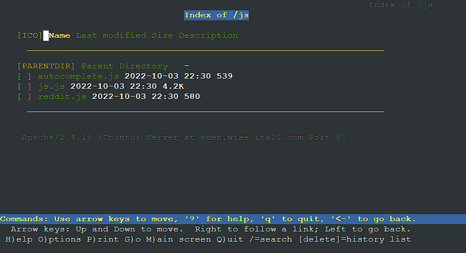

# soal-shift-jarkom-2-ITA01-2022

Repository Laporan Resmi Praktikum Jaringan Komputer Modul 2 Kelompok ITA01 Tahun 2022.

1. Damarhafni Rahmannabel Nadim P (5027201026)
2. Salman Al Farisi Sudirlan (5027201056)
3. I Putu Windy Arya Sagita (5027201071)

# Daftar Isi
* [Daftar Isi](https://github.com/windyarya/Jarkom-Modul-2-ITA01-2022/-/tree/main#daftar-isi)
* [Soal 1](https://github.com/windyarya/Jarkom-Modul-2-ITA01-2022/#soal-1)
* [Soal 2](https://github.com/windyarya/Jarkom-Modul-2-ITA01-2022/#soal-2)
* [Soal 3](https://github.com/windyarya/Jarkom-Modul-2-ITA01-2022/soal-3)
* [Soal 4](https://github.com/windyarya/Jarkom-Modul-2-ITA01-2022/#soal-4)
* [Soal 5](https://github.com/windyarya/Jarkom-Modul-2-ITA01-2022/#soal-5)
* [Soal 6](https://github.com/windyarya/Jarkom-Modul-2-ITA01-2022/#soal-6)
* [Soal 7](https://github.com/windyarya/Jarkom-Modul-2-ITA01-2022/#soal-7)
* [Soal 8](https://github.com/windyarya/Jarkom-Modul-2-ITA01-2022/#soal-8)
* [Soal 9](https://github.com/windyarya/Jarkom-Modul-2-ITA01-2022/#soal-9)
* [Soal 10](https://github.com/windyarya/Jarkom-Modul-2-ITA01-2022/#soal-10)
* [Soal 11](https://github.com/windyarya/Jarkom-Modul-2-ITA01-2022/#soal-11)
* [Soal 12](https://github.com/windyarya/Jarkom-Modul-2-ITA01-2022/#soal-12)
* [Soal 13](https://github.com/windyarya/Jarkom-Modul-2-ITA01-2022/#soal-13)
* [Soal 14](https://github.com/windyarya/Jarkom-Modul-2-ITA01-2022/#soal-14)
* [Soal 15](https://github.com/windyarya/Jarkom-Modul-2-ITA01-2022/#soal-15)
* [Soal 16](https://github.com/windyarya/Jarkom-Modul-2-ITA01-2022/#soal-16)
* [Soal 17](https://github.com/windyarya/Jarkom-Modul-2-ITA01-2022/#soal-17)

# Soal 8
Setelah melakukan konfigurasi server, maka dilakukan konfigurasi Webserver. Pertama dengan webserver ```www.wise.yyy.com```. Pertama, Loid membutuhkan webserver dengan DocumentRoot pada ```/var/www/wise.yyy.com```.

## Analisa Soal
Pada soal ini kami diperintahkan untuk membuat konfigurasi webserver DocumentRoot pada ```/var/www/wise.yyy.com``` dengan yyy adalah ita01.

## Pengerjaan Soal
### Client SSS dan Garden
Melakukan apt-get update serta menginstall lynx dengan command
```sh
apt-get update
apt-get install dnsutils -y
apt-get install lynx -y
```

### Server Eden
Pada soal ini kami melakukan instalasi apache, php, dan openssl agar dapat melakukan download ke website https dengan command:
```sh
apt-get install apache2 -y
service apache2 start
apt-get install php -y
apt-get install libapache2-mod-php7.0 -y
apt-get install ca-certificates openssl -y
apt-get install apache2-utils -y
```

kemudian kami membuat konfigurasi file DocumentRoot pada ```/etc/apache2/sites-available/wise.ita01.com.conf```.
```sh
<VirtualHost *:80>
        ServerAdmin webmaster@localhost
        DocumentRoot /var/www/wise.ita01.com
        ServerName wise.ita01.com
        ServerAlias www.wise.ita01.com
        ErrorLog \${APACHE_LOG_DIR}/error.log
        CustomLog \${APACHE_LOG_DIR}/access.log combined
</VirtualHost>
```

Kemudian kami membuat directory root untuk server ```wise.ita01.com```, mengunduh file, membuka zip unduhan, menyalin isi file, dan mengaktifkan virtualhost dengan a2ensite.
```sh
mkdir /var/www/wise.ita01.com
wget -c "https://drive.google.com/uc?export=download&id=1S0XhL9ViYN7TyCj2W66BNE$
unzip /root/wise.zip
cp -r /root/wise/. /var/www/wise.ita01.com
a2ensite wise.ita01.com
a2enmod rewrite
service apache2 restart
```
## Kendala
Tidak ada.

## Dokumentasi Soal 8
- Hasil Testing Soal 8 (```Lynx wise.ita01.com```)<br>


# Soal 9
Setelah itu, Loid juga membutuhkan agar url ```www.wise.yyy.com/index.php/home``` dapat menjadi menjadi ```www.wise.yyy.com/home```.

## Analisa Soal
Pada soal ini kami diperintahkan untuk dapat mengakses ```www.wise.yyy.com/index.php/home``` dengan url ```www.wise.yyy.com/home```.

## Pengerjaan Soal
### Server Eden
Dalam script bash Eden, kami menambahkan command echo yang akan menambahkan sintaks ke dalam ```/etc/apache2/sites-available/wise.ita01.com.conf``` sebagai berikut.
```sh
Alias "/home" "/var/www/wise.ita01.com/index.php/home"
```
Penggunaan Alias akan akan menerjemahkan direktori web ```/home``` menjadi ```/index.php/home```.

## Kendala
Tidak Ada.

## Dokumentasi Soal 9
- Hasil Testing Soal 9 (```Lynx wise.ita01.com/home```)<br>


# Soal 10
Setelah itu, pada subdomain ```www.eden.wise.yyy.com```, Loid membutuhkan penyimpanan aset yang memiliki DocumentRoot pada ```/var/www/eden.wise.yyy.com```.
## Analisa Soal
Soal ini mirip dengan soal nomor 8, hanya saja konfigurasi DocumentRoot kali ini dilakukan pada ```/var/www/eden.wise.yyy.com```.

## Pengerjaan Soal
### Server Eden
Kami membuat konfigurasi file DocumentRoot pada ```/etc/apache2/sites-available/wise.ita01.com.conf```.
```sh
<VirtualHost *:80>
        ServerAdmin webmaster@localhost
        DocumentRoot /var/www/eden.wise.ita01.com
        ServerName eden.wise.ita01.com
        ServerAlias www.eden.wise.ita01.com

        ErrorLog \${APACHE_LOG_DIR}/error.log
        CustomLog \${APACHE_LOG_DIR}/access.log combined
</VirtualHost>
```

Kemudian kami membuat directory root untuk server ```eden.wise.ita01.com```, mengunduh file, membuka zip unduhan, menyalin isi file dan mengaktifkan virtualhost dengan a2ensite.
```sh
mkdir /var/www/eden.wise.ita01.com
wget -c "https://drive.google.com/uc?export=download&id=1q9g6nM85bW5T9f5yoyXtDq$
unzip /root/eden.wise.zip
cp -r /root/eden.wise/. /var/www/eden.wise.ita01.com
a2ensite eden.wise.ita01.com
a2enmod rewrite
service apache2 restart
```

## Kendala
Tidak ada.

## Dokumentasi Soal 10
- Hasil Testing Soal 10 (```Lynx eden.wise.ita01.com ```)<br>


# Soal 11
Akan tetapi, pada folder /public, Loid ingin hanya dapat melakukan directory listing saja.
## Analisa Soal
Pada soal ini kami diminta membuat DirectoryListing pada /public.
## Pengerjaan Soal
### Server Eden
Kami menambahkan konfigurasi pada file ```/etc/apache2/sites-available/eden.wise.ita01.com.conf``` agar dapat membuat directory listing sebagai berikut.
```sh
<Directory /var/www/eden.wise.ita01.com/public>
      Options +Indexes
</Directory>

Alias "/public" "/var/www/eden.wise.ita01.com/public"
```

## Kendala
Tidak ada.

## Dokumentasi Soal 11
- Hasil Testing Soal 11 (```Lynx eden.wise.ita01.com/public```)<br>


# Soal 12
Tidak hanya itu, Loid juga ingin menyiapkan error file 404.html pada folder /error untuk mengganti error kode pada apache.
## Analisa Soal
Pada soal ini kami diminta membuat agar webserver dapat melakukan redirect ke /error apabila tidak ada endpoint pada web.
## Pengerjaan Soal
### Server Eden
Kami menambahkan konfigurasi dalam file ```/etc/apache2/sites-available/eden.wise.ita01.com.conf``` dan mengakses tag pada directory /public options + indexes pada /public dalam file tersebut yang telah dibuat pada soal 11 sebagai berikut.
```sh
#no 11
<Directory /var/www/eden.wise.ita01.com/public>
      Options +Indexes
</Directory>

ErrorDocument 404 /error/404.html
ErrorDocument 500 /error/404.html
ErrorDocument 502 /error/404.html
ErrorDocument 503 /error/404.html
ErrorDocument 504 /error/404.html
```

Dan dilakukan restart apache menggunakan command ```service apache2 restart```.

## Kendala
Tidak ada.

## Dokumentasi Soal 12
- Hasil Testing Soal 12 (```Lynx eden.wise.ita01.com/hahaha```)<br>


# Soal 13
Loid juga meminta Franky untuk dibuatkan konfigurasi virtual host. Virtual host ini bertujuan untuk dapat mengakses file asset www.eden.wise.yyy.com/public/js menjadi www.eden.wise.yyy.com/js.
## Analisa Soal
Pada soal ini kami diperintahkan untuk dapat mengakses ``` www.eden.wise.yyy.com/public/js``` dengan url ``` www.eden.wise.yyy.com/js ```.

## Pengerjaan Soal
### Server Eden
Dalam script bash Eden, kami menambahkan command echo yang akan menambahkan sintaks ke dalam ```/etc/apache2/sites-available/eden.wise.ita01.com.conf``` sebagai berikut.
```sh
Alias "/js" "/var/www/eden.wise.ita01.com/public/js"
```
Penggunaan Alias akan akan menerjemahkan direktori web ```/js``` menjadi ```/public/js```.

## Kendala
Tidak ada.

## Dokumentasi Soal 13
- Hasil Testing Soal 13 (```Lynx eden.wise.ita01.com/js```)<br>

